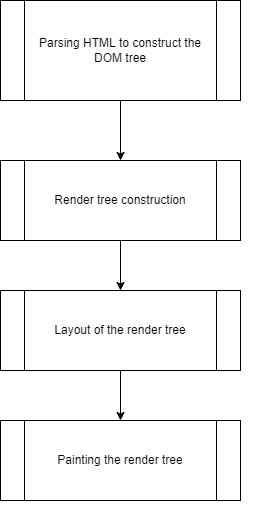
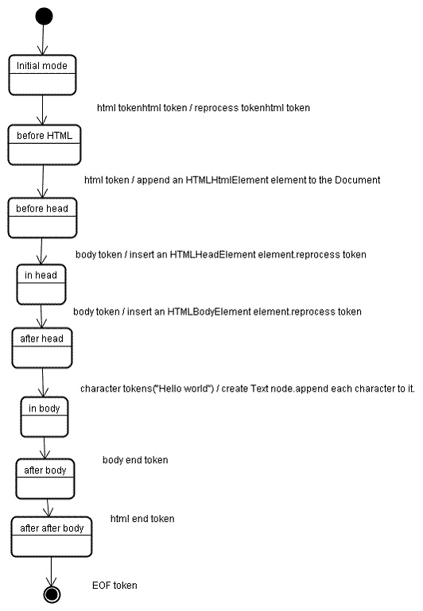

## Main Functionality of the Web Browser:

The main functionality of a web browser is to present the web resources to you choose by requesting if from the server and displaying the response in the web browser, the location of the resource is specified by using a URI(Uniform Resource Identifier)
The Browser user interface have a lot in comment with each other, among them are:
-	Address bar for inserting a URI
-	Back and forward buttons to navigating the page.
-	Bookmarking options
-	Refresh and stop buttons for refreshing or stopping the loading of current documents.
- Home button that takes your default set home page.

## High level Architecture of the Web Browser:

 
1.	***The User Interface:*** This is the space where the user interacts with the browser, this is where the user gets the appropriate response from the request made.
2.	***The Browser Engine:*** This acts like a bridge between User interface and the render engine, according to the user input from the user interface, it queries and manipulates the render engine.
3.	***The Rendering Engine:*** This component interprets the HTML, XML documents and images that are formatted using CSS and generates the layout that is displayed in the user interface.
4.	***Networking: Component:***  the browser which retrieves the URLs using the protocols of HTTP or FTP. The networking component handles the aspect of internet communication and security.
5.	***JavaScript Interpreter:*** This component as suggests interprets (parse and execute) the JavaScript code embedded in a website. The interpreted results are sent to the rendering engine for display. The Parser will hold until the JavaScript’s execution is not complete.
6.	***Data Persistence/Storage:*** This is a persistence layer, where the storage mechanism of such as Filesystems, Indexed Databases, User data stored in Caches, cookies, bookmarks and preferences.
7.	***UI Backend:*** This component is used for drawing basic widgets like combo boxes and widgets. This backend exposes a generic interface that is not Platform specific. Underneath it uses operating system user interface methods.

## DOM Tree:
The below example is for the DOM(Document Object Model) tree for HTML
 

## Render Engine’s main flow:
 
 
1.	Building a DOM tree: Get the data from Network layer, Parse the HTML, Create DOM Nodes(by elements). 
2.	Build Render Tree: Parse CSS, using the DOM Nodes and Parsed CSS information, build a Render tree. 
3.	Layout Process: Given coordinates position to each node, the elements will appear, always starts from root node. This process is recursive until the last element.
4.	Painting: Each node is painted, and uses the UI Backend component.

## CSS Parsing 
 
 
The lexical grammar (vocabulary) is defined by regular expressions for each token:
comment   \/\*[^*]*\*+([^/*][^*]*\*+)*\/
num       [0-9]+|[0-9]*"."[0-9]+
nonascii  [\200-\377]
nmstart   [_a-z]|{nonascii}|{escape}
nmchar    [_a-z0-9-]|{nonascii}|{escape}
name      {nmchar}+
ident     {nmstart}{nmchar}*

ruleset
  : selector [ ',' S* selector ]*
    '{' S* declaration [ ';' S* declaration ]* '}' S*
  ;
selector
  : simple_selector [ combinator selector | S+ [ combinator? selector ]? ]?
  ;
simple_selector
  : element_name [ HASH | class | attrib | pseudo ]*
  | [ HASH | class | attrib | pseudo ]+
  ;
class
  : '.' IDENT
  ;
element_name
  : IDENT | '*'
  ;
attrib
  : '[' S* IDENT S* [ [ '=' | INCLUDES | DASHMATCH ] S*
    [ IDENT | STRING ] S* ] ']'
  ;
pseudo
  : ':' [ IDENT | FUNCTION S* [IDENT S*] ')' ]
  ;

## Tree Construction for the Sample HTML page
 
The input to the tree construction stage is a sequence of tokens from the tokenization stage. The first mode is the "initial mode". Receiving the "html" token will cause a move to the "before html" mode and a reprocessing of the token in that mode. This will cause creation of the HTMLHtmlElement element, which will be appended to the root Document object.
The state will be changed to "before head". The "body" token is then received. An HTMLHeadElement will be created implicitly although we don't have a "head" token and it will be added to the tree.
We now move to the "in head" mode and then to "after head". The body token is reprocessed, an HTMLBodyElement is created and inserted and the mode is transferred to "in body".
The character tokens of the "Hello world" string are now received. The first one will cause creation and insertion of a "Text" node and the other characters will be appended to that node.
The receiving of the body end token will cause a transfer to "after body" mode. We will now receive the html end tag which will move us to "after after body" mode. Receiving the end of file token will end the parsing.

## The Order of script processing 
**Scripts:**
The model of the web is synchronous. Authors expect scripts to be parsed and executed immediately when the parser reaches a <script> tag. The parsing of the document halts until the script has been executed. If the script is external then the resource must first be fetched from the network - this is also done synchronously, and parsing halts until the resource is fetched. This was the model for many years and is also specified in HTML4 and 5 specifications. Authors can add the "defer" attribute to a script, in which case it will not halt document parsing and will execute after the document is parsed. HTML5 adds an option to mark the script as asynchronous so it will be parsed and executed by a different thread.
**Scripts:**
Style sheets on the other hand have a different model. Conceptually it seems that since style sheets don't change the DOM tree, there is no reason to wait for them and stop the document parsing. There is an issue, though, of scripts asking for style information during the document parsing stage. If the style is not loaded and parsed yet, the script will get wrong answers and apparently this caused lots of problems. It seems to be an edge case but is quite common. 

## Layout:
The layout process is done after the construction of the render tree, When the renderer is created and added to the tree, it doesn’t have the position and the size. The process of calculating these values Is called the Layout. Each node where to be appeared is determined here. The position of the root is rendered as (0,0) and its dimensions are the viewport visible part of the browser window. 
The Layout usually has this pattern:
1.	Parent renderer determines its own width.
2.	Parent goes over children and:
  	- Place the child renderer (sets its x and y).
   	- Calls child layout if needed - they are dirty or we are in a global layout, or for some other reason - which calculates the child's height.
3.	Parent uses children's accumulative heights and the heights of margins and padding to set its own height - this will be used by the parent renderer's parent.

## Painting
The painting order is in which the elements are stacked in the stacking contexts. This order affects painting since the stacks are painted from back to front. The stacking order of block renderer is :
1.	Background color
2.	Background Image
3.	Border
4.	Children
5.	Outline
Both Layout and painting are incremental activities in the page until all the nodes are covered.
